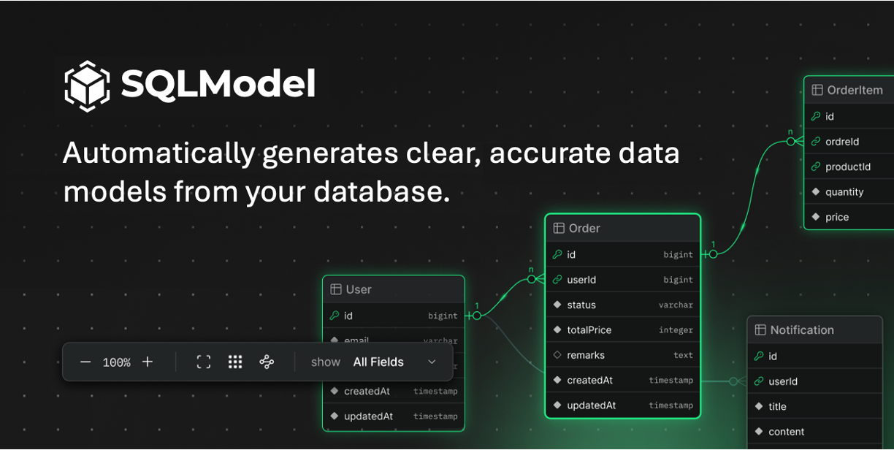

<p align="center">
  
</p>

<h1 align="center">SQLModel</h1>

<p align="center">
  <strong>Visual Data Modeling for Modern Teams</strong>
</p>

<p align="center">
  Design conceptual and physical database models with an intuitive canvas-based interface.<br/>
  Open source. No account required. Your data stays local.
</p>

<p align="center">
  
</p>

<p align="center">
  <a href="https://sqlmodel.org"><strong>🚀 Try it now at sqlmodel.org →</strong></a>
</p>

---

## ✨ What is SQLModel?

SQLModel is a **free, open-source data modeling tool** that helps you design database schemas visually. Whether you're architecting a new application, documenting an existing database, or collaborating with your team on data design, SQLModel provides an intuitive canvas for bringing your ideas to life. Try it at [sqlmodel.org](https://sqlmodel.org).

### Why SQLModel?

| Feature | Benefit |
|---------|---------|
| **Dual-Layer Modeling** | Design at the conceptual level (entities & relationships) then refine to physical tables with columns, types, and foreign keys |
| **AI-Powered Generation** | Describe your system in plain English and let AI generate complete data models — understands OLTP vs Analytics/Star Schema patterns |
| **Privacy-First** | Everything runs in your browser. No servers, no accounts, no data collection. Your models are yours. |
| **Export Ready** | Generate SQL DDL scripts for PostgreSQL, MySQL, and more. Export diagrams as images. |
| **Modern UX** | Built with React Flow for smooth pan, zoom, and drag interactions. Dark/light mode. Keyboard shortcuts. |

---

## 🚀 Getting Started

### Quick Start (Hosted)

Visit **[sqlmodel.org](https://sqlmodel.org)** to start modeling immediately — no installation required.

### Run Locally

```bash
# Clone the repository
git clone https://github.com/yourusername/sqlmodel.git
cd sqlmodel

# Install dependencies
npm install

# Start development server
npm run dev
```

Open [http://localhost:5173](http://localhost:5173) in your browser.

### Build for Production

```bash
npm run build
npm run preview
```

---

## 📖 How to Use

### 1. Create Entities (Conceptual View)

- Click **+ Entity** or right-click the canvas to add entities
- Double-click an entity to edit its name and description
- Drag from entity edges to create relationships
- Use the arrow buttons on entity sides to quickly create linked entities

### 2. Define Relationships

- Connect entities by dragging from one to another
- Set cardinality (1, 0..1, 1..*, 0..*) in the right panel
- Double-click relationship lines to add labels

### 3. Generate Physical Tables

- Switch to **Physical View** using the toggle in the navbar
- Use **AI → Generate Tables** to auto-create tables from your conceptual model
- Or manually add tables with columns, primary keys, and data types

### 4. Create Foreign Keys

- In Physical View, drag from a column to another table's column
- Configure cardinality and relationship type in the inspector

### 5. Export Your Work

- **Save JSON**: Export your complete model for backup or sharing
- **Export SQL**: Generate CREATE TABLE statements
- **Export Image**: Save your diagram as PNG

### 6. AI-Powered Modeling

Click the **AI** button (✨) to:
- **Generate New Model**: Describe your system and AI creates entities, relationships, and tables
- **Enhance Model**: Add features to an existing model
- **Smart Detection**: AI recognizes if you need OLTP (normalized) or Analytics (star schema) patterns

---

## 🛠️ Tech Stack

- **React 18** + **TypeScript** — Type-safe UI components
- **React Flow** — Canvas rendering, pan/zoom, node connections
- **Zustand** — Lightweight state management with persistence
- **Vite** — Fast development and optimized builds
- **Zod** — Runtime schema validation

---

## 📁 Project Structure

```
src/
├── components/
│   ├── Canvas.tsx          # Main diagram canvas
│   ├── nodes/              # Entity, Table, Group node components
│   ├── layout/             # Navbar, Sidebar, Right Panel
│   └── ui/                 # Dialogs, menus, shared components
├── model/
│   └── schemas.ts          # Zod schemas for all data types
├── services/
│   └── aiService.ts        # AI integration for model generation
└── store/
    └── useModelStore.ts    # Zustand state management
```

---

## 🤝 Contributing

Contributions are welcome! Please feel free to submit issues and pull requests.

```bash
# Run linting
npm run lint

# Type check
npx tsc --noEmit
```

---

## 📄 License

MIT License — free for personal and commercial use.

---

<p align="center">
  <sub>Built with ❤️ for data architects, developers, and anyone who thinks in tables.</sub><br/>
  <sub><a href="https://sqlmodel.org">sqlmodel.org</a></sub>
</p>
